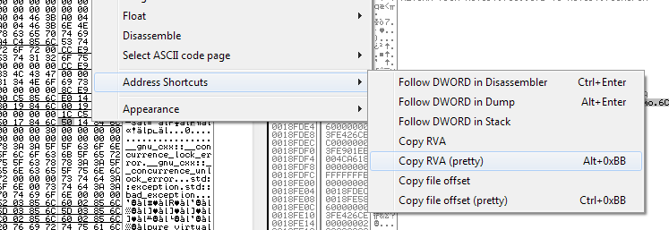

## Overview

This plugin adds the following menu options / shortcuts to OllyDbg v2.01:

* **Follow DWORD in Disassember** (Ctrl+Enter)
* **Follow DWORD in Dump** (Alt+Enter)
* **Follow DWORD in Stack**
* **Copy RVA** &mdash; Similar to Alt+Ins in Olly, except that the address will be relative to the start of the module.
* **Copy RVA (pretty)** (Alt+"+") &mdash; The string will be formatted as `helloworld+0x36a4`.
* **Copy file offset** &mdash; Similar to Alt+Ins in Olly, except that the address will be relative to the start of the file.
* **Copy file offset (pretty)** (Ctrl+"+") &mdash; The string will be formatted as `helloworld.dll+0x36a4`.

**Note:** The "+" key is at the top row of the keyboard, *not* the number pad.

The above keyboard shortcuts (Alt vs. Ctrl, etc.) were chosen rather arbitrarily, so feel free to change them.

## Usage

Simply drop address_shortcuts.dll next to your OllyDbg.exe, then restart OllyDbg, and Address Shortcuts should appear under your right-click menu.

Now, look at a C++ object (with virtual functions) in the Memory Dump pane. The first dword should be a vtable address. Press Alt+Enter to follow it. Now press Ctrl+Enter to quickly pull up any function in the Disassembly Pane, and Alt+"+" to copy its RVA in a pretty format (helloworld+0x36a4). And, as usual, use the familiar Numpad-Plus/Minus to navigate forwards/backwards and Alt+Ins to copy raw addresses. Copy/paste hex bytes with Ctrl+Ins/Shift+Ins, and generate pretty hexdumps with Ctrl+C.

## Compiling

You will need the [OllyDbg Plugin SDK (ollydbg.lib)](http://ollydbg.de/plug201h.zip).

Using GCC:

Copy CodeBlocks/plugin.h and CodeBlocks/ollydbg.lib from plug201h.zip into the current directory, then run:

    gcc -std=c99 -Wall -m32 -Os -g0 -funsigned-char -shared -nostartfiles -s -static-libgcc -o address_shortcuts.dll address_shortcuts.c ollydbg.lib

Using MSVC:

TODO...

## To do

* I'd prefer having Enter instead of Alt+Enter to follow in dump. This nearly works, except that OllyDbg also pops open an "Edit data at address" dialog in response to the enter key. We could patch Ollydbg to prevent this dialog (in response to enter only), but it would complicate this otherwise very simple script.
* Get pretty RVA's in other debuggers as well (x64dbg, windbg, gdb, ...).
